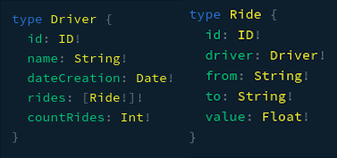
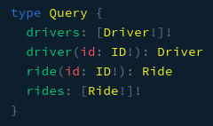
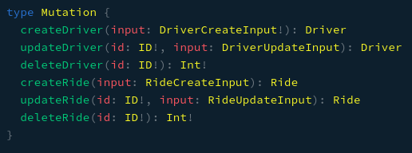

# Oowlish Node.js Engineer Test

This repository contains all the code made to the Node.js Engineer's test. It was separated in two folders: 

* backend: has the GraphQL API implementation and its tests.
* frontend: has a React.js Client that consumes data from the GraphQL API.

For the test, the following libraries and frameworks were used:

* [Node.js](https://nodejs.org)
* [Express](https://expressjs.com)
* [GraphQL.js](https://graphql.org/graphql-js/)
* [Apollo](https://www.apollographql.com/)
* [Sequelize](https://sequelize.org/)
* [Mocha](https://mochajs.org/)
* [Chai](https://www.chaijs.com/)

## Getting Started

The following instruction will let you know how to run the project on your machine.

### Prerequisites

Please, make sure if you have instaled Docker and Docker Compose on your machine. Try run these commands to check if both are installed:

```
$ docker --version
Docker version 19.03.2, build 6a30dfc

$ docker-compose --version
docker-compose version 1.24.1, build 4667896b
```

In case they are not installed, check the installation guide of [Docker](https://docs.docker.com/install/) and [Docker Compose](https://docs.docker.com/compose/install/).

## Running

To run the full project (GraphQL API and React Client), you can run the following command in the root of project:

```
$ docker-compose up
```

It will build and start the GraphQL API and React Client containers.

In case you want to run both separately, 
follow the instructions below:

#### GraphQL API

```
$ cd backend
$ yarn install
$ yarn start
```

#### React Client

```
$ cd frontend
$ yarn install
$ yarn start
```

Now you have the project running:

* GraphQL API: http://localhost:4000/graphql
* React Client: http://localhost:3000/

## Running Tests

### Prerequisites

To run the tests, you must have run or run the command `yarn install` at backend directory first, because the tests run outside the docker container, that is, they run in your local machine.

### Running 

```
$ cd backend
$ yarn test
```

## How GraphQL schemas are defined

### Data Types

#### Types



#### Queries



#### Mutations



## How to query data

As seen above, we have 4 kinds of query:

* drivers: return a list of drivers
* driver: return a single driver given an id
* rides: return a list of rides
* ride: return a single ride given an id

#### Examples

Returning id, name and countRides of all drivers:

```
query{
    drivers{
        id,
        name,
        countRides
    }
}
```
Output
```
{
  "data": {
        "drivers": [
            {
                "id": "1",
                "name": "Leandro L",
                "countRides": 6
            },
            {
                "id": "3",
                "name": "Haroldo Filho",
                "countRides": 2
            },
            {
                "id": "5",
                "name": "Brenda Lima",
                "countRides": 3
            },
            {
                "id": "27",
                "name": "Sample Test",
                "countRides": 1
            }
        ]
  }
}
```

Returning name and rides from a single driver:

```
driver(id: 1){
    name,
    rides{
        from,
        to,
        value
    }
}
```
Output:
```
{
    "data": {
        "driver": {
            "name": "Leandro L",
            "rides": [
                {
                    "from": "Dina Sfat, 89",
                    "to": "Vasco de Ataíde, 526",
                    "value": 10.5
                },
                {
                    "from": "Dina Sfat, 89",
                    "to": "Vasco de Ataíde, 526",
                    "value": 10.5
                },
                {
                    "from": "Mars",
                    "to": "Earth",
                    "value": 50000
                },
                ...
            ]
        }
    }
}
```

Returning id, from, to, value and driver's name of all rides:

```
query{
    rides{
        from,
        to,
        value,
        driver{
            name
        }
    }
}
```

Output:

```
{
  "data": {
        "rides": [
        {
            "from": "Dina Sfat, 89",
            "to": "Vasco de Ataíde, 526",
            "value": 10.5,
            "driver": {
                "name": "Leandro L"
            }
        },
        {
            "from": "Dina Sfat, 89",
            "to": "Vasco de Ataíde, 526",
            "value": 10.5,
            "driver": {
                "name": "Leandro L"
            }
        },
        {
            "from": "IFCE Maracanaú",
            "to": "UFC Campus PICI",
            "value": 35.76,
            "driver": {
                "name": "Leandro L"
            }
        },
        {
            "from": "Lagoa Redonda",
            "to": "IFCE",
            "value": 24,
            "driver": {
                "name": "Haroldo Filho"
            }
        },
        {
            "from": "Messejana",
            "to": "Baturité",
            "value": 12345,
            "driver": {
                "name": "Haroldo Filho"
            }
        },
        {
            "from": "Califórnia",
            "to": "Nova York",
            "value": 570,
            "driver": {
                "name": "Brenda Lima"
            }
        },
        {
            "from": "Nowhere's Land",
            "to": "Fortaleza",
            "value": 54,
            "driver": {
                "name": "Sample Test"
            }
        },
        ...
    ]
  }
}
```

Returning from, to, value, and driver's name from a single ride:

```
query{
    ride(id: 10){
        from,
        to,
        value,
        driver{
            name
        }
    }
}
```
Output:
```
{
    "data": {
        "ride": {
            "from": "Las Vegas",
            "to": "Califórnia",
            "value": 123,
            "driver": {
                "name": "Brenda Lima"
            }
        }
    }
}
```

## How to mutate data

As seen above, we have 6 kinds of mutations:

* createDriver: create one new driver, and return its information
* updateDriver: update an existent driver, and return its updated information
* deleteDriver: delete an existent driver
* createRide: create one new ride, and return its information
* updateRide: update an existent ride, and return its updated information
* deleteRide: delete an existent ride

### Examples

Creating new driver, and returning its name and dateCreation:

```
mutation{
    createDriver(input: {name: "Jon Connor", dateCreation: "2019-09-13"}){
        name,
        dateCreation
    }
}
```
Output:

```
{
    "data": {
        "createDriver": {
        "name": "Jon Connor",
        "dateCreation": "2019-09-13T00:00:00.000Z"
        }
    }
}
```

Updating an existing driver and returning its name:

```
mutation{
    updateDriver(id: 1, input: { name: "Leandro L" }){
      	name
    }
}
```
Output:

```
{
    "data": {
        "updateDriver": {
        "name": "Leandro L"
        }
    }
}
```

Deleting an existent driver

```
mutation{
    deleteDriver(id: 27)
}
```
Output

```
{
    "data": {
        "deleteDriver": 1
    }
}
```

Creating a new Ride and return from, to and driver's name: 

```
mutation{
    createRide(input: {driverId: 1, from: "UFC Campus PICI", to: "Dina Sfat, 89", value: 55.76}){
        from,
        to,
        driver{
            name
        }
    }
}
```

Output:

```
{
    "data": {
        "createRide": {
            "from": "UFC Campus PICI",
            "to": "Dina Sfat, 89",
            "driver": {
                "name": "Leandro L"
            }
        }
    }
}
```

Updating an existing ride and returning from, to:

```
mutation{
    updateRide(id: 1, input: {to: "Vasco de Ataíde, 526", from: "Dina Sfat, 89", value: 10.5}){
        from,
        to
    }
}
```

Output:

```
{
    "data": {
        "updateRide": {
            "from": "Dina Sfat, 89",
            "to": "Vasco de Ataíde, 526"
        }
    }
}
```

Deleting an existent ride:

```
mutation{
   deleteRide(id: 13)
}
```

Output:

```
{
    "data": {
        "deleteRide": 1
    }
}
```

## Author

[Leandro Lima](https://github.com/limaleandro1999)